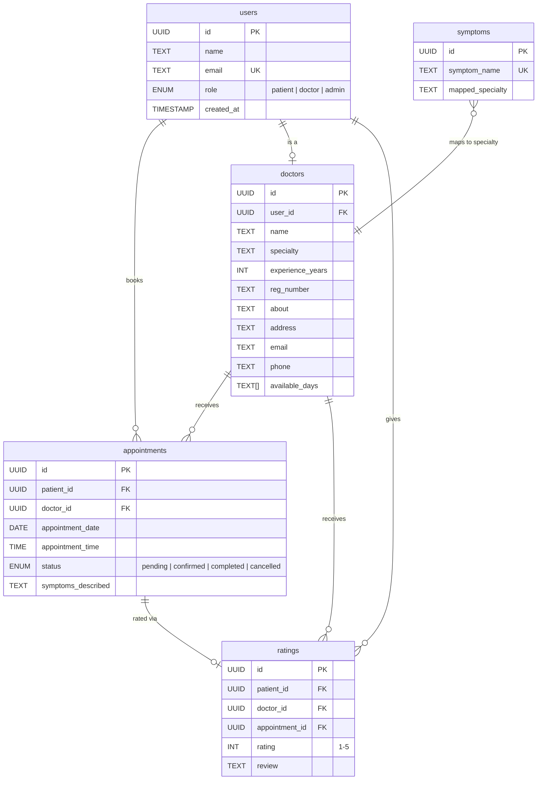

<p align="center">
  
</p>

<h1 align="center">MedConnect — Symptom-Based Doctor Appointment System</h1>

<p align="center">
  <strong>An intelligent healthcare platform that routes patients to the right specialist based on their symptoms.</strong>
</p>

<p align="center">
  <a href="https://supabase.com/"></a>
  <a href="https://developer.mozilla.org/en-US/docs/Web/JavaScript"></a>
  <a href="https://www.postgresql.org/"></a>
  
  
</p>

<p align="center">
  <a href="#-features">Features</a> •
  <a href="#-architecture">Architecture</a> •
  <a href="#-screenshots">Screenshots</a> •
  <a href="#-getting-started">Getting Started</a> •
  <a href="#-database-schema">Database</a> •
  <a href="#-project-structure">Structure</a>
</p>

---

## 📋 Overview

**MedConnect** is a full-stack, zero-build web application built entirely with Vanilla JavaScript and powered by Supabase. It solves a common healthcare problem: *patients often don't know which specialist to consult.* MedConnect uses an intelligent symptom-to-specialty mapping engine to guide patients to the right doctor, then provides a seamless booking flow — all within a premium, glassmorphism-styled interface.

---

## ✨ Features

### 🧠 Intelligent Symptom Routing Engine
| Capability | Description |
|---|---|
| **Symptom Selection** | Interactive card-based checklist with real-time search filtering |
| **Specialty Mapping** | Each symptom is mapped to a medical specialty in the database |
| **Frequency Analysis** | When multiple symptoms are selected, the system tallies specialty hits and routes to the most relevant one |
| **Auto-Prefill** | Selected symptoms are automatically carried into the booking form |
| **Recommended Banner** | Doctor directory highlights the recommended specialty with a visual banner |

### 🔐 Authentication & Authorization
| Capability | Description |
|---|---|
| **Email/Password Auth** | Secure signup and login via Supabase Auth |
| **Google OAuth** | One-click login with Google; auto-syncs profile via database trigger |
| **Role-Based Access** | Three roles — `patient`, `doctor`, `admin` — each with dedicated dashboards |
| **Route Guards** | Protected pages redirect unauthorized users with toast notifications |
| **Session Persistence** | Auth state persists across page reloads via Supabase session management |

### 👨‍⚕️ Doctor Directory
| Capability | Description |
|---|---|
| **Rich Profile Cards** | Avatar initials, specialty badge, experience, location, email, and availability days |
| **Specialty Filtering** | Dropdown filter to browse doctors by specialty |
| **Star Ratings** | Aggregated patient ratings displayed on each doctor card (★ 1–5 scale) |
| **Deep Linking** | Symptom checker auto-filters the directory to the recommended specialty |
| **One-Click Booking** | "Book Appointment" button on each card pre-selects the doctor |

### 📅 Appointment Booking System
| Capability | Description |
|---|---|
| **Date Selection** | Date picker restricted to today and future dates |
| **Time Slots** | Pre-defined 30-minute slots from 9:00 AM to 5:00 PM (with lunch break) |
| **Symptom Notes** | Free-text field, auto-populated from the symptom checker |
| **Success Confirmation** | Animated modal confirming the appointment upon submission |
| **Status Workflow** | Appointments flow through: `Pending → Confirmed → Completed` (or `Cancelled`) |

### 📊 Patient Dashboard
| Capability | Description |
|---|---|
| **Upcoming Tab** | View all future, non-cancelled appointments with doctor details |
| **History Tab** | Browse past and completed appointments |
| **Cancel Appointments** | One-click cancellation with real-time status update |
| **Rate & Review** | Interactive 5-star rating modal with hover preview and optional text review |
| **Doctor Contact Info** | View doctor's address, email, and phone directly from appointment cards |

### 🩺 Doctor Dashboard
| Capability | Description |
|---|---|
| **Appointment Requests** | View all `pending` appointments from patients |
| **Accept / Decline** | Confirm or cancel incoming requests with one click |
| **Confirmed Schedule** | Dedicated view for confirmed upcoming appointments |
| **Mark Complete** | Transition confirmed appointments to `completed` status |
| **Patient Details** | View patient name, email, symptoms, and appointment time |

### 🛡️ Admin Dashboard
| Capability | Description |
|---|---|
| **Analytics Overview** | Real-time stat cards: Total Patients, Total Doctors, Today's Appointments, Completed Total |
| **Status Charts** | Custom bar charts showing appointment distribution by status |
| **Specialty Charts** | Top 5 specialties by appointment volume |
| **Doctor Management** | Tabular view of all doctors with the ability to delete entries |
| **Symptom Management** | Tag cloud of all symptoms with search, add (via modal), and delete functionality |
| **Symptom Statistics** | Total symptoms, specialties covered, average symptoms per specialty |

### 🎨 Premium UI/UX
| Capability | Description |
|---|---|
| **Glassmorphism Design** | Semi-transparent cards with backdrop blur effects |
| **Inter Typography** | Google Fonts (Inter) for a clean, modern feel |
| **CSS Custom Properties** | Full design token system for colors, spacing, and typography |
| **Micro-Animations** | Slide-up entrances, fade-ins, card lifts, and spinner overlays |
| **Toast Notifications** | Color-coded (success/error/info) toast system with auto-dismiss |
| **Responsive Layout** | Fully responsive — desktop, tablet, and mobile optimized |
| **Loading Overlays** | Glass-panel spinner overlays during async operations |
| **Empty States** | Friendly empty-state illustrations with contextual messaging |

---

## 🏗️ Architecture

```
┌─────────────────────────────────────────────────────────┐
│                     FRONTEND                            │
│  Vanilla JS (ES6 Modules) + HTML5 + CSS3                │
│  ┌──────────┐ ┌──────────┐ ┌──────────┐ ┌────────────┐ │
│  │ Landing  │ │  Auth    │ │ Symptom  │ │  Doctors   │ │
│  │  Page    │ │  Pages   │ │ Checker  │ │  Directory │ │
│  └──────────┘ └──────────┘ └──────────┘ └────────────┘ │
│  ┌──────────┐ ┌──────────┐ ┌──────────┐                │
│  │ Booking  │ │ Patient  │ │  Doctor  │                │
│  │  Flow    │ │Dashboard │ │Dashboard │                │
│  └──────────┘ └──────────┘ └──────────┘                │
│                 ┌──────────┐                            │
│                 │  Admin   │                            │
│                 │Dashboard │                            │
│                 └──────────┘                            │
├─────────────────────────────────────────────────────────┤
│              Supabase JS Client (CDN)                   │
├─────────────────────────────────────────────────────────┤
│                  SUPABASE BACKEND                       │
│  ┌──────────┐ ┌──────────┐ ┌──────────────────────┐    │
│  │  Auth    │ │ Realtime │ │     PostgreSQL DB    │    │
│  │ (Email + │ │  (Live   │ │  ┌───────────────┐   │    │
│  │  Google) │ │  Queries)│ │  │  Row Level    │   │    │
│  └──────────┘ └──────────┘ │  │  Security     │   │    │
│                            │  └───────────────┘   │    │
│                            └──────────────────────┘    │
└─────────────────────────────────────────────────────────┘
```

> **Zero Build Step**: The app uses ES Modules and loads `@supabase/supabase-js` via CDN, so no Webpack/Vite/bundler is required.

---

## 🗄️ Database Schema



### Row Level Security (RLS)

All tables have RLS enabled with granular policies:

| Table | Policy | Description |
|---|---|---|
| `users` | Read own / Read all (auth) | Authenticated users can read profiles; users can update their own |
| `doctors` | Public read | Anyone can browse doctor profiles; doctors manage their own; admins manage all |
| `symptoms` | Public read | Anyone can read symptom mappings; admins manage all |
| `appointments` | Role-scoped | Patients see/manage their own; Doctors see assigned appointments; Admins see all |
| `ratings` | Public read | Anyone can read ratings; Patients can insert ratings for their appointments |

---

## 🚀 Getting Started

### Prerequisites
- A free [Supabase](https://supabase.com/) account
- Any local web server (VS Code Live Server, Python, Node.js, etc.)

### 1. Clone the Repository
```bash
git clone https://github.com/adithyapalvadi/Doctor_Appiontment_System.git
cd Doctor_Appiontment_System
```

### 2. Set Up Supabase

1. Create a new project on [Supabase Dashboard](https://app.supabase.com/).
2. Navigate to **SQL Editor** and run the following scripts **in order**:

   | # | File | Purpose |
   |---|---|---|
   | 1 | `supabase/schema.sql` | Creates tables, enums, and RLS policies |
   | 2 | `supabase/seed.sql` | Populates symptoms mapping and sample doctors |
   | 3 | `supabase/google-auth-trigger.sql` | *(Optional)* Enables Google OAuth user sync |
   | 4 | `supabase/admin-policies.sql` | *(Optional)* Additional admin RLS policies |

3. Enable **Email** provider under Authentication → Providers.
4. *(Optional)* Enable **Google** provider for OAuth login.

### 3. Configure API Keys

1. Go to **Project Settings → API** in your Supabase Dashboard.
2. Copy your **Project URL** and **anon (public) key**.
3. Rename the config file:
   ```bash
   cp js/supabase-config.example.js js/supabase-config.js
   ```
4. Update the values:
   ```javascript
   const SUPABASE_URL = 'https://your-project-id.supabase.co';
   const SUPABASE_ANON_KEY = 'your-public-anon-key';
   ```

### 4. Launch the App

```bash
# Option 1: Python
python -m http.server 3000

# Option 2: Node.js
npx serve .

# Option 3: VS Code
# Install "Live Server" extension → Right-click index.html → "Open with Live Server"
```

Open `http://localhost:3000` in your browser.

### 5. Create Test Accounts

| Role | How to Create |
|---|---|
| **Patient** | Sign up via the app (select "Patient") |
| **Doctor** | Sign up via the app (select "Doctor" — fill specialty, registration number, etc.) |
| **Admin** | Manually update a user's `role` to `admin` in Supabase Table Editor |

---

## 📂 Project Structure

```
appointment-system/
│
├── 📄 index.html                 # Landing page — hero, features, CTA
├── 📄 auth.html                  # Login / Signup with tab switching
├── 📄 symptoms.html              # Interactive symptom checker
├── 📄 doctors.html               # Doctor directory with filtering
├── 📄 booking.html               # Appointment booking form
├── 📄 patient-dashboard.html     # Patient portal (upcoming + history)
├── 📄 doctor-dashboard.html      # Doctor portal (requests + schedule)
├── 📄 admin-dashboard.html       # Admin portal (analytics + management)
│
├── 📁 css/
│   └── style.css                 # 27KB — Full design system (variables, glassmorphism,
│                                 #         animations, responsive breakpoints)
│
├── 📁 js/
│   ├── supabase-config.js        # Supabase client init (gitignored)
│   ├── supabase-config.example.js# Template for config
│   ├── app.js                    # AuthManager, AppUtils (toast, loading, date formatting)
│   ├── auth.js                   # Login, Signup, Google OAuth, role-based redirect
│   ├── symptoms.js               # Symptom selection, search, specialty calculation
│   ├── doctors.js                # Doctor cards, ratings aggregation, specialty filter
│   ├── booking.js                # Date/time selection, form submission, success modal
│   ├── dashboard-patient.js      # Appointment tabs, cancel flow, rating modal
│   ├── dashboard-doctor.js       # Request management, status transitions
│   └── dashboard-admin.js        # Analytics, charts, CRUD for doctors & symptoms
│
├── 📁 supabase/
│   ├── schema.sql                # Tables, enums, RLS policies
│   ├── seed.sql                  # 37KB — Symptom mappings + 50+ sample doctors
│   ├── google-auth-trigger.sql   # OAuth user sync trigger
│   ├── admin-policies.sql        # Extended admin RLS rules
│   └── fix-database.sql          # Migration/fix scripts
│
├── 📁 images/
│   └── hero-bg.png               # Hero section background
│
├── 📄 package.json
├── 📄 .gitignore
└── 📄 README.md
```

---

## 🛠️ Tech Stack

| Layer | Technology |
|---|---|
| **Language** | JavaScript (ES6+ Modules) |
| **Markup** | HTML5 Semantic Elements |
| **Styling** | CSS3 (Custom Properties, Grid, Flexbox, Glassmorphism) |
| **Typography** | [Inter](https://fonts.google.com/specimen/Inter) via Google Fonts |
| **Backend** | [Supabase](https://supabase.com/) (PostgreSQL + Auth + Realtime) |
| **Authentication** | Supabase Auth (Email/Password + Google OAuth 2.0) |
| **Database** | PostgreSQL with Row Level Security |
| **Hosting** | Any static file server (GitHub Pages, Vercel, Netlify) |

---

## 🔒 Security

- **Row Level Security (RLS)** on every table — no data leaks even if the anon key is exposed.
- **Role-based route guards** on every protected page.
- **Auth state management** with Supabase session tokens.
- **SQL Injection safe** — all queries go through Supabase's parameterized client.
- **CORS-protected** — Supabase handles CORS at the API gateway level.

---

## 🤝 Contributing

1. **Fork** the repository
2. **Create** a feature branch: `git checkout -b feature/my-feature`
3. **Commit** your changes: `git commit -m 'feat: add my feature'`
4. **Push** to the branch: `git push origin feature/my-feature`
5. **Open** a Pull Request

---

## 📜 License

This project is licensed under the **ISC License**. See [package.json](package.json) for details.

---

## ⚠️ Disclaimer

> **This application is for educational and demonstrative purposes only.** The symptom-to-specialty routing is based on static database mappings and does **not** constitute professional medical advice, diagnosis, or treatment. Always consult a qualified healthcare provider for medical decisions.

---

<p align="center">
  Built with ❤️ by <a href="https://github.com/adithyapalvadi">Adithya Palvadi</a>
</p>
